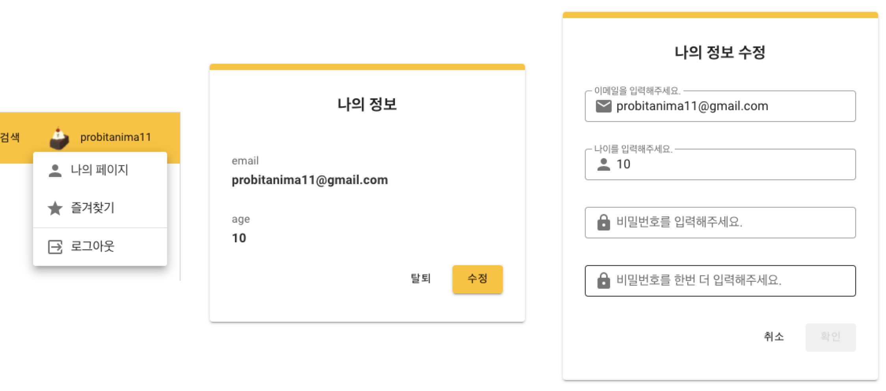

<p align="center">
    
</p>
<p align="center">
  
  
  <a href="https://edu.nextstep.camp/c/R89PYi5H" alt="nextstep atdd">
    
  </a>
  
</p>

<br>

# 지하철 노선도 미션
[ATDD 강의](https://edu.nextstep.camp/c/R89PYi5H) 실습을 위한 지하철 노선도 애플리케이션

<br>

## 🚀 Getting Started

### Install
#### npm 설치
```
cd frontend
npm install
```
> `frontend` 디렉토리에서 수행해야 합니다.

### Usage
#### webpack server 구동
```
npm run dev
```
#### application 구동
```
./gradlew bootRun
```
<br>

## ✏️ Code Review Process
[텍스트와 이미지로 살펴보는 온라인 코드 리뷰 과정](https://github.com/next-step/nextstep-docs/tree/master/codereview)

<br>

## 🐞 Bug Report

버그를 발견한다면, [Issues](https://github.com/next-step/atdd-subway-service/issues) 에 등록해주세요 :)

<br>

## 📝 License

This project is [MIT](https://github.com/next-step/atdd-subway-service/blob/master/LICENSE.md) licensed.

## 💡 미션 소개 - 지하철 정보 서비스
### 미션을 통해 구현할 항목
- 지하철 경로 조회<br>

- 인증을 통한 기능 구현
  - 토근 발급(로그인) 화면
  
  - 내 정보 관리 화면
  
  - 즐겨찾기 화면
  
- 요금 조회<br>


### 인수 테스트 기반 TDD : 단위 테스트 - 협력 객체에 따른 구분
**[ 단위 테스트란? ]**
- 작은 코드 조각을 검증
- 빠르게 수행 가능
- 격리된 방식으로 처리

**[ 단위 테스트 내 협력 객체(통합 vs 고립) ]**
- 협력 객체를 실제 객체로 사용하는지 Mock(가짜) 객체로 사용하는지에 따라 테스트 구현 달라짐
- Test Double: 실제 객체 대신 사용되는 모든 종류의 객체에 대한 일반 용어 ⇨ 실제를 가짜 버전으로 대체한다는 의미
  - Dummy Object
  - Test Stub
  - Test Spy
  - Mock Object
  - Fake Object

**[ 협력 객체를 실제 객체(통합)로? 가짜 객체(고립)로? ]**
- 실제 객체를 사용하면 협력 객체의 행위를 협력 객체 스스로가 정의
  - 실제 객체를 사용하면 협력 객체의 상세 구현에 대해 알 필요 없음
  - 하지만 협력 객체의 정상 동작 여부에 영향 받음
- 가짜 객체를 사용하면 협력 객체의 행위를 테스트가 정의
  - 테스트 대상을 검증할 때 외부 요인(협력 객체)으로 부터 격리
  - 하지만 테스트가 협력 객체의 상세 구현을 알아야 함
> - TDD를 연습할 때는 가급적 실제 객체 활용하는 것을 우선으로 진행<br>
> - 테스트 작성이 어렵거나 흐름이 잘 이어지지 않을 때 테스트 더블 활용 추천

## 1단계 - 인수 테스트 기반 리팩터링
### 요구 사항
#### LineService 리팩터링
* [ ] LineService의 비즈니스 로직을 도메인으로 옮기기
* [ ] 한 번에 많은 부분을 고치지 않고 부분부분 리팩터링
* [ ] 전체 기능은 인수 테스트로 보호한 뒤 세부 기능을 TDD로 리팩터링
1. LineService에 대한 인수 테스트 작성
2. Domain으로 옮길 로직 찾기
   * 스프링 빈을 사용하는 객체와 의존하는 로직을 제외하고 도메인으로 옮기기
   * 객체지향 생활체조 참고 
     * 규칙 1: 한 메서드에 오직 한 단계의 들여쓰기(indent)만 한다.
     * 규칙 2: else 예약어를 쓰지 않는다.
     * 규칙 3: 모든 원시값과 문자열을 포장한다.
     * 규칙 4: 한 줄에 점을 하나만 찍는다.
     * 규칙 5: 줄여쓰지 않는다(축약 금지).
     * 규칙 6: 모든 엔티티를 작게 유지한다.
     * 규칙 7: 3개 이상의 인스턴스 변수를 가진 클래스를 쓰지 않는다.
     * 규칙 8: 일급 콜렉션을 쓴다.
     * 규칙 9: 게터/세터/프로퍼티를 쓰지 않는다.
3. Domain의 단위 테스트 작성하기
   * 서비스 레이어에서 옮겨올 로직의 기능 테스트
   * SectionTest나 LineTest 클래스가 생성될 수 있음
4. 로직을 옮기기
   * 기존 로직을 지우지 않고 새로운 로직 만들어 수행
   * 정상 동작 확인 후 기존 로직 제거
#### LineSectionAScceptanceTest 리팩터링
* [ ] API 검증이 아닌 시나리오, 흐름을 검증하는 테스트로 리팩터링
* [ ] 기능의 인수 조건을 설명할 때 하나 이상의 시나리오가 필요한 경우 여러 시나리오 만들어 인수 테스트 작성
##### 인수 조건 예시
  ```text
  Feature: 지하철 구간 관련 기능

  Background 
    Given 지하철역 등록되어 있음
    And 지하철 노선 등록되어 있음
    And 지하철 노선에 지하철역 등록되어 있음

  Scenario: 지하철 구간을 관리
    When 지하철 구간 등록 요청
    Then 지하철 구간 등록됨
    When 지하철 노선에 등록된 역 목록 조회 요청
    Then 등록한 지하철 구간이 반영된 역 목록이 조회됨
    When 지하철 구간 삭제 요청
    Then 지하철 구간 삭제됨
    When 지하철 노선에 등록된 역 목록 조회 요청
    Then 삭제한 지하철 구간이 반영된 역 목록이 조회됨
  ```
### LineService 기능목록
- [x] 지하철 노선 생성
- [x] 지하철 노선 목록 조회
- [x] 지하철 노선 조회
- [x] 지하철 노선 수정
- [x] 지하철 노선 삭제
- [x] 지하철 노선 내 구간 추가
- 지하철 노선 내 역 삭제(구간 삭제)
